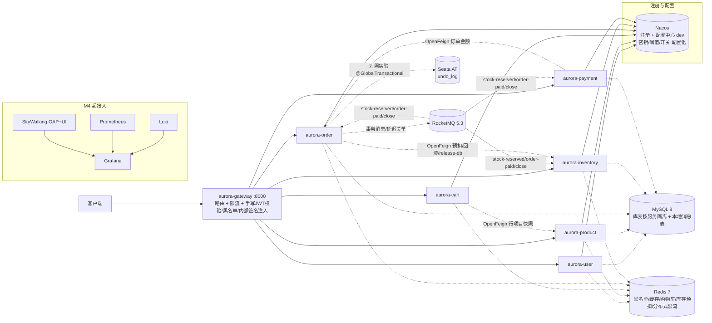

# aurora-mall

[](https://github.com/zeng-bohan/aurora-mall/actions/workflows/ci.yml)

从 0 构建的 Java 微服务电商系统：7 个微服务 + 完整交易链路 + 手写分布式组件，每一个架构决策都可在本地复现、用数据验证。

**当前状态**：M0-M3 已交付（工程骨架 / 用户-商品-购物车 / 订单-库存-支付与分布式事务 / 手写限流熔断与简化 RPC），M4（可观测性 + 压测）进行中。

## 这个系统能让你看到什么

- **完整交易链路**：下单 → Redis 原子预扣库存 → RocketMQ 事务消息落库 → 支付回调推进状态 → 30 分钟未支付延迟关单回滚库存。每一步的幂等、补偿、对账都有实现与测试。
- **两种一致性方案可切换对照**：主链路走 MQ 最终一致性；同一下单流程可经配置开关切到 Seata AT（`aurora.tx.mode=at`），一致性窗口与回滚行为有[对照实验报告](docs/m2-tx-comparison.md)。
- **手写分布式组件**（读源码级理解，非黑盒调用）：[分布式 ID 生成器](aurora-id-generator/README.md)（号段双 buffer + 雪花时钟回拨守卫）、[限流器与熔断器](aurora-ratelimit/README.md)（滑动窗口 / 令牌桶 / 三态熔断，基准对比 Guava）、[简化 RPC](aurora-rpc/README.md)（自定义协议 + Netty + 注册发现 + 负载均衡，与 OpenFeign 配置切换）。
- **缓存三防**：Cache Aside + 空值缓存 + 手写布隆过滤器 + 逻辑过期/互斥重建，防穿透 / 防击穿 / 防雪崩。
- **三级验收接缝**：中间件就绪（smoke.sh）→ 服务健康（smoke-services.sh）→ 业务金路径（smoke-flows.sh，60+ 断言可重复执行）。
- **网关限流**：Redis ZSET + Lua 分布式滑动窗口，按路由配置阈值，Nacos 动态下发即时生效。

设计决策全部记录在 [docs/adr/](docs/adr/)（0001 技术栈 → 0008 手写组件），每个决策附放弃项。

## 架构总览



链路约定：业务请求一律经网关（白名单放行≠直连放行——服务侧校验 `X-Internal-Secret`）；服务间调用走 Nacos 发现 + Feign。交易主链路采用 **RocketMQ 事务消息 + 延迟关单** 的最终一致性（ADR-0003）。

## 环境要求

| 依赖 | 版本 | 说明 |
| --- | --- | --- |
| JDK | 21 | Temurin 实测通过 |
| Maven | 3.9+ | 版本矩阵由父 POM 钉死，无需手动对齐 |
| Docker Desktop | ≥6GB 可用内存 | 中间件全家桶（MySQL/Redis/Nacos/RocketMQ/观测栈） |
| Git Bash | Windows 需 | smoke 脚本为 bash |

> 密码口径：compose 里 MySQL 的 `aurora123` 是 **dev-only** 默认值（与宿主端口偏移同因，便于本地一键起栈）；生产凭据走 nacos 配置中心 + 部署时注入（JWT/internal secret 即此口径）。上线前必须替换全部默认密码。

## 快速开始（10 分钟）

```bash
git clone https://github.com/zeng-bohan/aurora-mall.git && cd aurora-mall
```

**1. 起基础设施全家桶**（MySQL/Redis/Nacos/RocketMQ/SkyWalking/Prometheus/Grafana/Loki）：

```bash
cd docker && docker compose up -d && bash smoke.sh && bash nacos/import.sh
```

看到 `smoke OK` 即中间件就绪（首次拉镜像约 10 分钟）。`nacos/import.sh` 把密钥与各服务配置导入 Nacos（命名空间 dev，密钥本地生成不进 git）——**必须在启动服务前执行**，否则服务启动即失败（fail-fast）。详见 [docker/README.md](docker/README.md)。

**2. 构建并启动 7 个服务**（网关 :8000，业务服务 :8081-8086；SkyWalking agent 存在时自动挂载）：

```bash
cd .. && mvn clean package
AGENT=""; [ -d tools/skywalking-agent ] &&   AGENT="-javaagent:$PWD/tools/skywalking-agent/skywalking-agent.jar"
for svc in gateway user product cart order inventory payment; do
  java $AGENT -DSW_AGENT_NAME=aurora-$svc     -DSW_AGENT_COLLECTOR_BACKEND_SERVICES=localhost:11800     -jar "aurora-$svc/target/aurora-$svc-0.1.0-SNAPSHOT.jar" > /tmp/"$svc".log 2>&1 &
done
```

agent 二进制获取见 [tools/README.md](tools/README.md)（约 46MB，不入 git；缺席时跳过参数，行为不变）。

**3. 验收**：两级接缝

```bash
bash docker/smoke-services.sh   # 网关 + 6 服务健康端点全 200
bash docker/smoke-flows.sh      # 68 断言：金路径 + 两条交易链 + 网关限流链
bash docker/smoke-rpc.sh        # 链 D：切换手写 RPC 实测后自动还原（可选）
```

两个脚本都输出 `OK` / `... green` 即验收通过。`smoke-flows.sh` 每次运行自建用户与商品，可重复执行。

## 使用示例

一次完整的「登录 → 下单 → 幂等重试」交互（均经网关）：

```bash
# 登录拿 token
curl -s -X POST http://localhost:8000/api/user/login \
  -H "Content-Type: application/json" \
  -d '{"username":"alice","password":"pass123"}'
# → {"code":0,"data":{"accessToken":"eyJ...","refreshToken":"..."}}   双 token

# 下单（Idempotency-Key 防重复提交）
curl -s -X POST http://localhost:8000/api/order/orders \
  -H "Authorization: Bearer $TOKEN" -H "Idempotency-Key: demo-key-1" \
  -H "Content-Type: application/json" \
  -d '{"skuId":100,"quantity":3}'
# → {"code":0,"data":{"orderId":...,"status":0}}   待支付

# 同一个 Idempotency-Key 重放 → 幂等拒绝
curl -s -X POST http://localhost:8000/api/order/orders \
  -H "Authorization: Bearer $TOKEN" -H "Idempotency-Key: demo-key-1" \
  -H "Content-Type: application/json" \
  -d '{"skuId":100,"quantity":3}'
# → {"code":40900,"message":"..."}   重复请求
```

### 业务端点速查

| 分组 | 端点 | 说明 |
| --- | --- | --- |
| 认证（公开） | `POST /api/user/register` `login` `refresh` | 注册/登录/续期，返回双 token |
| 认证（需 token） | `POST /api/user/logout` · `GET /api/user/me` | 登出即黑名单，旧 token 立即 401 |
| 商品（公开读） | `GET /api/product/products` · `GET .../products/{id}` · `GET .../products/batch` | 游客可读，详情走缓存三防 |
| 商品（admin） | `POST/PUT/DELETE /api/product/admin/products...` | 需 `role=ADMIN`，写路径延迟双删 |
| 购物车（需 token） | `GET/POST/PUT/DELETE /api/cart/carts...` | Redis Hash，行项目含商品快照 |
| 订单（需 token） | `POST /api/order/orders`（带 `Idempotency-Key`）· `GET /api/order/orders/{id}` | 事务消息主链路，30min 未支付自动关单 |
| 支付（需 token） | `POST /api/payment/payments` · `GET /api/payment/payments/{orderId}` | mock 通道；`POST .../mock-callback` 为第三方回调入口（免用户 token） |

### 运行中的控制台

| 服务 | 地址 | 说明 |
| --- | --- | --- |
| 网关 | http://localhost:8000 | 业务入口 `/api/<service>/**` |
| 健康检查 | `/actuator/health`（各服务直连或经网关） | smoke 断言项 |
| Nacos 控制台 | http://localhost:8848/nacos | 服务注册/配置（限流阈值在此动态下发） |
| RocketMQ 控制台 | http://localhost:8180 | Topic/消费组 |
| SkyWalking UI | http://localhost:8090 | 链路追踪 |
| Grafana | http://localhost:3000（admin/aurora123） | 指标/日志大盘 |
| Prometheus | http://localhost:9090 | 指标抓取 |
| MySQL / Redis | 宿主 **13306** / **16379**（root/aurora123） | 网络内仍为标准端口 |

> 端口说明：本机开发机上 8080/3306/6379 被其他常驻项目占用，故网关与 MySQL/Redis 的**宿主端口**做了映射偏移；服务间网络内通信一律走标准端口。

> 配置更新说明：`docker/nacos/import.sh` 只在**首次导入后**由 nacos 持有；改了 import.sh（或仓库内其他 nacos 配置源）后需**重跑一遍**才能生效，已运行的 nacos 不会自动感知文件变化。

## 测试

```bash
mvn test          # 全模块单测（238 例；依赖外部环境的集成测试在无环境时自动跳过）
mvn -pl aurora-ratelimit test    # 单模块：限流算法 + 熔断状态机 + Guava 基准
mvn -pl aurora-rpc test          # 单模块：协议/传输/注册发现（真 Netty 往返，零外部依赖）
```

验收接缝（本地栈起后）：`docker/smoke.sh`（中间件）→ `docker/smoke-services.sh`（服务健康）→ `docker/smoke-flows.sh`（业务金路径，两条交易链：**链 A** 下单→重复 40900→支付→库存收敛→回调重放无副作用；**链 B** 经配置中心把关单延迟临时调至 10s→下单→等待自动关单→库存恢复→配置还原）。

## 路线图

| 阶段 | 内容 | 状态 |
| --- | --- | --- |
| M0 | 工程骨架：版本矩阵 + 中间件全家桶 + 7 服务注册 + 网关路由 + CI | ✅ 完成 |
| M1 | 用户 / 商品 / 购物车（JWT 鉴权、Cache Aside 三防、配置中心） | ✅ 完成 |
| M2 | 订单 / 库存 / 支付（RocketMQ 事务消息、Seata 对照、统一幂等组件、ID 生成器） | ✅ 完成 |
| M3 | 手写组件：限流熔断 + 简化 RPC（与 OpenFeign 切换）+ 端口收敛 | ✅ 完成 |
| M4 | 可观测性 + 网关强化 + JMeter 压测报告 | 未开始 |
| M5 | 秒杀 / 优惠券 / ShardingSphere 分库试点 | 未开始 |
| M6 | 完整前端（Vue3 用户端 + 管理后台） | 未开始 |
| M7 | kind 练习 + 买服务器 + ICP 备案 + 上线 | 未开始 |

任务拆解见 [GitHub Issues](https://github.com/zeng-bohan/aurora-mall/issues)（每里程碑一份 spec + 依赖排序的 tracer-bullet 工单）。

## 文档索引

- [CONTEXT.md](CONTEXT.md) — 项目定位、领域词汇表、工程约定
- [docs/adr/](docs/adr/) — 架构决策记录（0001 技术栈 → 0008 手写组件）
- [docs/m2-tx-comparison.md](docs/m2-tx-comparison.md) — MQ 最终一致 vs Seata AT 对照实验报告
- [docs/m3-rpc-comparison.md](docs/m3-rpc-comparison.md) — OpenFeign vs 手写 RPC 对照报告（等价性证据 + 微基准 + 边界）
- [aurora-id-generator/README.md](aurora-id-generator/README.md) · [aurora-ratelimit/README.md](aurora-ratelimit/README.md) · [aurora-rpc/README.md](aurora-rpc/README.md) — 手写组件的设计取舍与实测数据
- [docs/agents/](docs/agents/) — AI 协作配置（issue tracker / 标签 / 领域文档）

## 协作约定

- 分支：trunk-based + feature 分支，merge 前经 review
- 语言：代码标识符与提交信息用英文，注释跟随文档用中文
- 测试：核心链路（库存扣减 / 幂等 / 订单状态机 / 手写组件）必写单测，不追覆盖率
- 问题与建议走 [GitHub Issues](https://github.com/zeng-bohan/aurora-mall/issues)

## CI

push / PR 触发 [GitHub Actions](.github/workflows/ci.yml)：`mvn verify`（Temurin 21 + Maven 缓存）→ 逐服务构建层式 Docker 镜像（仅本地构建验证，不推送）。

## 许可证

暂未声明（个人学习项目）。上线前随发布决定。
