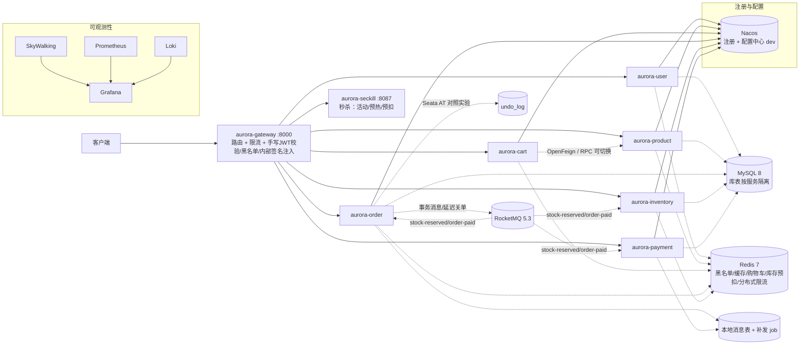

<div align="center">

# 🌌 aurora-mall

**从 0 构建的 Java 微服务电商系统** —— 7 个微服务、完整交易链路、手写分布式组件，每一个架构决策都可在本地复现、用数据验证。

[](https://github.com/zeng-bohan/aurora-mall/actions/workflows/ci.yml)


**当前状态**：M0-M4 已交付（骨架 / 用户-商品-购物车 / 交易链路与分布式事务 / 手写限流熔断与 RPC / 可观测性与压测）；M5 进行中——秒杀已交付活动模型与库存预热、Lua 原子预扣、MQ 异步落单与失败补偿、并发冒烟接缝（优惠券与 ShardingSphere 分库试点待做）。

</div>

---

## 📖 这是什么

一个把「分布式原理」当一等公民对待的电商系统：下单 → Redis 原子预扣 → RocketMQ 事务消息 → 支付回调 → 延迟关单，每一步的幂等、补偿、对账都有实现与测试。它特殊在三个地方：

- **🛠️ 手写分布式组件**（读源码级理解，非黑盒调用）：[分布式 ID](aurora-id-generator/README.md)、[限流器与熔断器](aurora-ratelimit/README.md)（基准对比 Guava）、[简化 RPC](aurora-rpc/README.md)（自定义协议 + Netty，与 OpenFeign 一键切换）；
- **⚖️ 两种一致性方案可切换对照**：主链路走 MQ 最终一致性，同一下单流程可切 Seata AT（`aurora.tx.mode=at`），窗口期与回滚行为有[对照报告](docs/m2-tx-comparison.md)；
- **✅ 三级验收接缝**：中间件就绪 → 服务健康 → 业务金路径（68 断言可重复执行），任何时刻停下都是可运行的作品。

## 🏗️ 架构总览



交易主链路：**RocketMQ 事务消息 + 延迟关单**的最终一致性；服务间调用走 Nacos 发现 + Feign（cart→product 可切手写 RPC）；服务侧校验 `X-Internal-Secret`，内部路径与用户身份流量在网关和服务两侧双重封死。

## 🧰 技术栈

| 层 | 选型 | 版本 |
| --- | --- | --- |
| 语言/框架 | JDK · Spring Boot · Spring Cloud · Spring Cloud Alibaba | 21 · 3.5.0 · 2025.0.0 · 2025.0.0.0 |
| 存储 | MySQL · Redis | 8.0 · 7 |
| 消息 | RocketMQ（事务消息 + 延迟消息） | 5.3.1 |
| 分布式事务 | RocketMQ 事务消息 ⇄ Seata AT（对照） | 2.5.0 |
| 可观测 | SkyWalking · Prometheus · Grafana · Loki | 9.7 · v2.54 · 11.3 · 3.4 |
| 手写组件 | ID 生成器 · 限流/熔断 · RPC（协议+Netty+注册发现） | 见各 README |

## ✨ 核心亮点

- **完整交易链路**：预扣 → 事务消息 → 支付回调推进 → 30 分钟未支付延迟关单回滚；幂等、补偿、对账全链路闭环——含支付/关单竞态的退款信号（钱收了单关了会自动退）。
- **缓存三防**：Cache Aside + 空值缓存 + 手写布隆过滤器（线程安全 + 定期重播种）+ 逻辑过期/互斥重建。
- **过载保护**：网关 Redis 分布式滑动窗口限流（Nacos 动态阈值）+ 逐接口熔断器（失败率/慢调用双触发）。
- **秒杀（M5）**：Redis+Lua 原子预扣（时间窗 / 一人一单 / 库存三合一判定）、MQ 异步落单削峰（请求路径零 DB 访问）、失败补偿恰好一次、订单唯一键 + DB 条件扣减兜底不超卖。
- **安全模型**：手写 JWT（黑名单注销、refresh 一次一换、登出会话级失效）、内部密钥 + 内部路径守卫 + 用户身份守卫、回调渠道 HMAC 签名、常量时间比较。
- **验收文化**：343 例测试 + 三级 smoke 接缝 + 可观测性活体验证 + 真 Netty/真 Redis 集成测试（无环境自动跳过）。

## 🚀 快速开始

前置：JDK 21 · Maven 3.9+ · Docker Desktop（≥6GB 可用内存）· Git Bash（Windows）。

```bash
git clone https://github.com/zeng-bohan/aurora-mall.git && cd aurora-mall
```

**1️⃣ 起基础设施全家桶**（MySQL/Redis/Nacos/RocketMQ/SkyWalking/Prometheus/Grafana/Loki）：

```bash
cd docker && docker compose up -d && bash smoke.sh && bash nacos/import.sh
```

看到 `smoke OK` 即中间件就绪（首次拉镜像约 10 分钟）。`nacos/import.sh` 生成密钥并导入全部运行时配置（**必须在启动服务前执行**，否则服务 fail-fast 拒绝启动）。详见 [docker/README.md](docker/README.md)。

**2️⃣ 构建并启动 8 个服务**（SkyWalking agent 存在时自动挂载）：

```bash
cd .. && mvn clean package
AGENT=""; [ -d tools/skywalking-agent ] && \
  AGENT="-javaagent:$PWD/tools/skywalking-agent/skywalking-agent.jar"
for svc in gateway user product cart order inventory payment seckill; do
  java $AGENT -DSW_AGENT_NAME=aurora-$svc \
    -DSW_AGENT_COLLECTOR_BACKEND_SERVICES=localhost:11800 \
    -jar "aurora-$svc/target/aurora-$svc-0.1.0-SNAPSHOT.jar" > /tmp/"$svc".log 2>&1 &
done
```

**3️⃣ 验收**：

```bash
bash docker/smoke-services.sh   # 网关 + 7 服务健康端点全 200
bash docker/smoke-flows.sh      # 68 断言：金路径 + 两条交易链 + 网关限流链
bash docker/smoke-seckill.sh    # 秒杀：并发抢购不超卖 / 一人一单 / Redis 与 DB 收敛一致
bash docker/smoke-rpc.sh        # 可选：切手写 RPC 实测后自动还原
```

三个脚本都输出 `OK` / `... green` 即验收通过。`smoke-flows.sh` 自建用户与商品，`smoke-seckill.sh` 自建活动并预热，都可重复执行。

## 🎮 使用示例

一次完整的「登录 → 下单 → 幂等重试」交互（均经网关）：

```bash
# 登录拿 token
curl -s -X POST http://localhost:8000/api/user/login \
  -H "Content-Type: application/json" \
  -d '{"username":"alice","password":"secret123"}'
# → {"code":0,"data":{"accessToken":"eyJ...","refreshToken":"..."}}

# 下单（Idempotency-Key 防重复提交）
curl -s -X POST http://localhost:8000/api/order/orders \
  -H "Authorization: Bearer $TOKEN" -H "Idempotency-Key: demo-key-1" \
  -H "Content-Type: application/json" \
  -d '{"skuId":100,"quantity":3}'
# → {"code":0,"data":{"orderId":...,"status":0}}    待支付

# 同一个 Idempotency-Key 重放 → 幂等拒绝
# → {"code":40900,"message":"..."}
```

<details>
<summary><b>📋 业务端点速查</b>（点击展开）</summary>

| 分组 | 端点 | 说明 |
| --- | --- | --- |
| 认证（公开） | `POST /api/user/register` `login` `refresh` | 注册/登录/续期，双 token |
| 认证（需 token） | `POST /api/user/logout` · `GET /api/user/me` | 登出即黑名单，旧 token 立即 401 |
| 商品（公开读） | `GET /api/product/products` · `GET .../products/{id}` · `GET .../batch` | 游客可读，缓存三防 |
| 商品（admin） | `POST/PUT/DELETE /api/product/admin/products...` | 需 `role=ADMIN`，写路径延迟双删 |
| 购物车（需 token） | `GET/POST/PUT/DELETE /api/cart/carts...` | Redis Hash，行项目含商品快照 |
| 订单（需 token） | `POST /api/order/orders`（带 `Idempotency-Key`）· `GET .../{id}` | 30min 未支付自动关单 |
| 支付（需 token） | `POST /api/payment/payments` · `GET .../{orderId}` | mock 通道；回调带渠道 HMAC 签名 |

</details>

### 🖥️ 运行中的控制台

| 服务 | 地址 | 说明 |
| --- | --- | --- |
| 网关 | http://localhost:8000 | 业务入口 `/api/<service>/**` |
| SkyWalking UI | http://localhost:8090 | 链路追踪与拓扑 |
| Grafana | http://localhost:3000（admin/aurora123） | 指标/日志大盘 |
| Prometheus | http://localhost:9090 | 指标抓取 |
| Nacos 控制台 | http://localhost:8848/nacos | 服务注册/配置（限流阈值动态下发） |
| RocketMQ 控制台 | http://localhost:8180 | Topic/消费组 |
| MySQL / Redis | 宿主 **13306** / **16379**（root/aurora123） | 网络内为标准端口 |

> ⚠️ **已知陷阱**：① 8080/3306/6379 在本机被其他项目占用，宿主端口做了偏移（服务间通信走标准端口）；② MySQL `aurora123` 为 **dev-only** 默认值，生产凭据走 nacos + 部署注入；③ 修改 `import.sh` 后需**重跑**才能生效（nacos 不感知文件变化）；④ SkyWalking agent 二进制不入 git，获取见 [tools/README.md](tools/README.md)。

## 🔭 可观测性与压测

可观测栈走 provisioning（不手点控制台），一条命令活体验证：

```bash
bash docker/smoke-observability.sh   # 3 断言：Prometheus targets 全 UP / Loki 按 traceId 命中 / OAP 有 trace
```

| 组件 | 已交付内容 |
| --- | --- |
| Grafana | provisioning 自动装配：Prometheus + Loki 数据源、大盘「aurora-mall 全链路总览」、告警规则「order 服务 5xx 比例过高」（2 分钟 5xx 比例 >5%，持续 1 分钟）→ webhook 接点（本地 `docker/webhook-receiver.py` 可收验） |
| Prometheus | 8 个服务的 `/actuator/prometheus` 抓取目标全部 UP（含 M5 新增的秒杀） |
| Loki | loki4j 直推日志，可按 traceId 跨服务检索一次请求的全部日志 |
| SkyWalking | agent 挂进 7 个服务（秒杀同样带 toolkit 依赖，agent 由启动参数决定），OAP 可查到真实链路 |

压测（M4 T6）：同一购物车金路径、同参数下 Feign 与手写 RPC 的阶梯对照（10/50/100 线程），报告见 [docs/m4-load-test.md](docs/m4-load-test.md)，计划文件 `docker/jmeter/aurora-load.jmx` 可原样重放。结论摘要：默认 Feign 在 50 线程起出现失败、100 线程 28.5% 请求失败（客户端临时端口耗尽），手写 RPC 100 线程零错误、吞吐约 2.5×。

压测（M5 S3）：秒杀抢购在「活动限流关闭 / 打开（300 req/s）」两轮下的对照（10/50/100 线程、各 20s/档、每请求一个不同买家），报告见 [docs/m5-seckill-load-test.md](docs/m5-seckill-load-test.md)，计划文件 `docker/jmeter/aurora-seckill.jmx` 可原样重放。结论摘要：两轮 20 万级尝试下限量 3000 **恰好**成交 3000，Redis 与 DB 同时收敛到 0、无残留 PENDING（无超卖无丢单）；限流窗口峰值精确封顶在 300（ZCARD 逐秒采样），入口挡掉约 92.6% 的尝试；**无限流那轮在这台单机上并未被打挂**（2,897/s、中位 5–7ms）——限流的价值在于把中签路径（MQ + DB）的成本按预算摊平，而不是"保护闸门"。

## 🧪 测试

```bash
mvn test                          # 全模块测试；外部依赖类集成测试无环境自动跳过
mvn -pl aurora-rpc test           # 手写 RPC：协议/传输/注册发现（真 Netty，零外部依赖）
mvn -pl aurora-ratelimit test     # 限流算法 + 熔断状态机 + Guava 对照基准
```

验收接缝：`docker/smoke.sh`（中间件）→ `docker/smoke-services.sh`（健康）→ `docker/smoke-flows.sh`（金路径：链 A 下单→支付→库存收敛→回调重放；链 B 经配置中心改关单延迟→自动关单→库存恢复→配置还原）→ `docker/smoke-seckill.sh`（秒杀：并发抢购不超卖、一人一单、结果收敛、Redis 与 DB 口径一致）。

## 🗺️ 路线图

| 阶段 | 内容 | 状态 |
| --- | --- | --- |
| M0 | 工程骨架 + 中间件全家桶 + CI | ✅ |
| M1 | 用户 / 商品 / 购物车（JWT、缓存三防） | ✅ |
| M2 | 订单 / 库存 / 支付（事务消息、Seata 对照、幂等、ID 生成器） | ✅ |
| M3 | 手写组件：限流熔断 + RPC + 端口切换 | ✅ |
| M4 | 可观测性（SkyWalking/指标/Loki/告警）+ JMeter 压测报告 | ✅ |
| M5 | 秒杀 / 优惠券 / ShardingSphere 分库试点 | 🚧 秒杀已交付（S1 活动与预热 / S2 Lua 预扣 + MQ 异步落单 / S3 冒烟接缝 + 活动维度限流 + 压测报告） |
| M6 | 完整前端（Vue3 用户端 + 管理后台） | 未开始 |
| M7 | 部署上线（服务器 + ICP 备案） | 未开始 |

## 📚 文档索引

- [docs/m2-tx-comparison.md](docs/m2-tx-comparison.md) — MQ 最终一致 vs Seata AT 对照实验
- [docs/m3-rpc-comparison.md](docs/m3-rpc-comparison.md) — OpenFeign vs 手写 RPC 对照（等价性 + 微基准 + 边界）
- [docs/m4-load-test.md](docs/m4-load-test.md) — 同链路压测对照（Feign vs 手写 RPC，阶梯 10/50/100 线程）
- [docs/m5-seckill-load-test.md](docs/m5-seckill-load-test.md) — 秒杀压测对照（活动限流关闭 vs 打开，含量级/一致性证据）
- [aurora-id-generator/README.md](aurora-id-generator/README.md) · [aurora-ratelimit/README.md](aurora-ratelimit/README.md) · [aurora-rpc/README.md](aurora-rpc/README.md) — 手写组件设计取舍与实测数据

## 🤝 协作

- 分支：trunk-based + feature 分支，merge 前经 review
- 语言：代码标识符与提交信息用英文，注释跟随文档用中文
- 核心链路（库存扣减 / 幂等 / 状态机 / 手写组件）必写单测，不追覆盖率
- 问题与建议走 [GitHub Issues](https://github.com/zeng-bohan/aurora-mall/issues)

## 📄 许可证

暂未声明（个人学习项目），上线前随发布决定。
